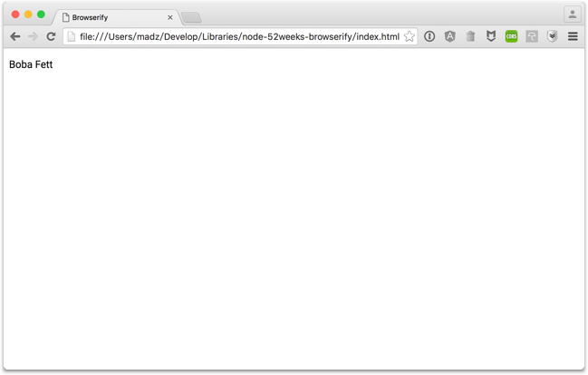

## 52 周玩转 52 Node 包 丨 browserify
🙊 [查看全部计划](PLAN.md)

**第 02 周（2016.03.14）** [browserify](https://www.npmjs.com/package/browserify) 篇

### browserify 简介
browserify 的作用是能让你在浏览器端跑 node-style 的代码，如：`require()`。它的原理是递归查找应用中所有的 `require()` 调用依赖，从而生成出一个能安置在浏览器 `
</body>
</html>
~~~

这时，当我们打开 `index.html` 就能看到 `main.js` 的业务逻辑成功的在浏览器端运行了。

#### 外部引用
`browserify` 允许在命令行中使用 `require` 参数来做外部引用，而这些外部引用往往来自其他的 `script` 标签：

~~~bash
# -r 即 --require，后跟模块名称或者本地模块，还可通过一个冒号分隔符来自定义模块名称
$ browserify -r starwars-names-dothide \
-r ./external.main.js:external > external.bundle.js
~~~

~~~html
<!-- external.index.html -->
<!DOCTYPE html>
<html>
<head>
  <title>External</title>
</head>
<body>
  

  
  
</body>
</html>
~~~

最终的浏览器效果跟上例相似

### 工作原理
在深入了解如何使用 browserify 和它的工作原理之前，我们需要首先理解基于 CommonJS 系统的 Node 究竟是怎么工作的。

#### require
在 node 中，`require()` 方法被用来从其他文件载入代码，类似于 ruby 中的 `require` 。

例如：通过 npm 安装 `uniq` 组件

~~~shell
$ npm install uniq
~~~

然后，在我们自己的文件中，可以这样来引用它

~~~js
var uniq = require('uniq');
var nums = [ 5, 2, 1, 3, 2, 5, 4, 2, 0, 1 ];
console.log(uniq(nums));
~~~

接着，使用 node 命令执行该文件，可以得到：

~~~shell
$ node nums.js # [ 0, 1, 2, 3, 4, 5 ]
~~~

如果你要引用的是本地相对位置的文件，可以这样来写：

~~~js
// 同级目录
var foo = require('./foo.js');

// 父级目录
var bar = require('../bar.js');

// 子目录
var zoo = require('subfolder/zoo.js');
~~~

#### exports
从一个文件中导出一个方法来其他文件引入，将方法赋值给 `module.exports` ：

~~~js
// foo.js
module.exports = function (n) {
    return n * 111
};
~~~

~~~js
// main.js
var foo = require('./foo.js');
console.log(foo(5)); 

// Output: 555
~~~

然而，你还可以用 `module.exports` 导出任何类型，如：

~~~js
module.exports = 555;
~~~

甚至是这样：

~~~js
var numbers = [];
for (var i = 0; i < 100; i++) numbers.push(i);
module.exports = numbers;
~~~

##### module.exports 和 exports
此外，还有一种特殊的导出形式，就是直接使用 `exports`，但它必须指定对象，这种情况下就能用 `exports` 直接替代 `module.exports`：

~~~js
exports.beep = function (n) { return n * 1000 }
exports.boop = 555;
~~~

以上代码跟以下代码效果一致：

~~~js
module.exports.beep = function (n) { return n * 1000 }
module.exports.boop = 555;
~~~

**但是**，你不能这样来使用：

~~~js
// this doesn't work
exports = function (n) { return n * 1000 }
~~~

